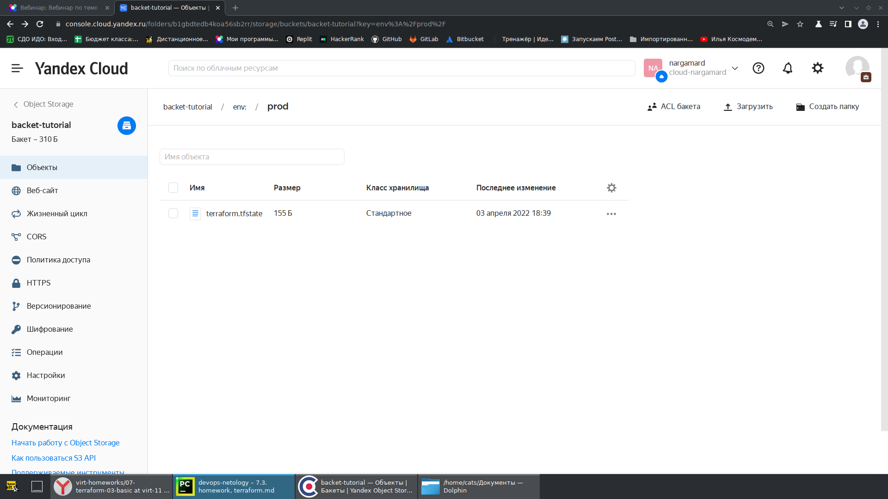

#Домашнее задание к занятию "7.3. Основы и принцип работы Терраформ"

##Задача 1. Создадим бэкэнд в S3

Ответ: делаю в yandex, поскольку Amazon не хочет меня видеть.

Вот так выглядит соответствующая секция в main.tf:
```text
terraform {
  required_providers {
    yandex = {
      source  = "yandex-cloud/yandex"
      version = "0.61.0"
    }
  }
  backend "s3" {
  endpoint   = "storage.yandexcloud.net"
  bucket     = "backet-tutorial"
  region     = "ru-central1"
  key        = "terraform.tfstate"
  access_key = "YCAJE_FvHO38A0E4gjfLWCKeg"
  secret_key = "YCOunXW0e2lVgFDFhJyQcXbjVj0To2hJdxkVKtAl"

  skip_region_validation      = true
  skip_credentials_validation = true
  }
}
```

##Задача 2. Инициализируем проект и создаем воркспейсы.

Ответ: воркспейсы готовы:
```text
[cats@host-63 tf]$ terraform workspace list
  default
* prod
  stage
```

Терраформ инициализирован, в бакет сохраняет:


Вывод команды `terraform plan`:
```text
[cats@host-63 tf]$ terraform plan

Terraform used the selected providers to generate the following execution plan. Resource actions are indicated with the following symbols:
  + create

Terraform will perform the following actions:

  # yandex_compute_instance.node["prod"] will be created
  + resource "yandex_compute_instance" "node" {
      + created_at                = (known after apply)
      + folder_id                 = (known after apply)
      + fqdn                      = (known after apply)
      + hostname                  = "node_name.netology.yc - prod"
      + id                        = (known after apply)
      + name                      = "prod"
      + network_acceleration_type = "standard"
      + platform_id               = "standard-v1"
      + service_account_id        = (known after apply)
      + status                    = (known after apply)
      + zone                      = (known after apply)

      + boot_disk {
          + auto_delete = true
          + device_name = (known after apply)
          + disk_id     = (known after apply)
          + mode        = (known after apply)

          + initialize_params {
              + description = (known after apply)
              + image_id    = "fd8mfc6omiki5govl68h"
              + name        = "root-node"
              + size        = 10
              + snapshot_id = (known after apply)
              + type        = "network-nvme"
            }
        }

      + network_interface {
          + index              = (known after apply)
          + ip_address         = (known after apply)
          + ipv4               = true
          + ipv6               = (known after apply)
          + ipv6_address       = (known after apply)
          + mac_address        = (known after apply)
          + nat                = (known after apply)
          + nat_ip_address     = (known after apply)
          + nat_ip_version     = (known after apply)
          + security_group_ids = (known after apply)
          + subnet_id          = (known after apply)
        }

      + placement_policy {
          + placement_group_id = (known after apply)
        }

      + resources {
          + core_fraction = 100
          + cores         = 2
          + memory        = 2
        }

      + scheduling_policy {
          + preemptible = (known after apply)
        }
    }

  # yandex_compute_instance.node["stage"] will be created
  + resource "yandex_compute_instance" "node" {
      + created_at                = (known after apply)
      + folder_id                 = (known after apply)
      + fqdn                      = (known after apply)
      + hostname                  = "node_name.netology.yc - stage"
      + id                        = (known after apply)
      + name                      = "stage"
      + network_acceleration_type = "standard"
      + platform_id               = "standard-v1"
      + service_account_id        = (known after apply)
      + status                    = (known after apply)
      + zone                      = (known after apply)

      + boot_disk {
          + auto_delete = true
          + device_name = (known after apply)
          + disk_id     = (known after apply)
          + mode        = (known after apply)

          + initialize_params {
              + description = (known after apply)
              + image_id    = "fd8mfc6omiki5govl68h"
              + name        = "root-node"
              + size        = 10
              + snapshot_id = (known after apply)
              + type        = "network-nvme"
            }
        }

      + network_interface {
          + index              = (known after apply)
          + ip_address         = (known after apply)
          + ipv4               = true
          + ipv6               = (known after apply)
          + ipv6_address       = (known after apply)
          + mac_address        = (known after apply)
          + nat                = (known after apply)
          + nat_ip_address     = (known after apply)
          + nat_ip_version     = (known after apply)
          + security_group_ids = (known after apply)
          + subnet_id          = (known after apply)
        }

      + placement_policy {
          + placement_group_id = (known after apply)
        }

      + resources {
          + core_fraction = 100
          + cores         = 2
          + memory        = 2
        }

      + scheduling_policy {
          + preemptible = (known after apply)
        }
    }

  # yandex_vpc_network.default will be created
  + resource "yandex_vpc_network" "default" {
      + created_at                = (known after apply)
      + default_security_group_id = (known after apply)
      + folder_id                 = (known after apply)
      + id                        = (known after apply)
      + name                      = "net"
      + subnet_ids                = (known after apply)
    }

  # yandex_vpc_subnet.default will be created
  + resource "yandex_vpc_subnet" "default" {
      + created_at     = (known after apply)
      + folder_id      = (known after apply)
      + id             = (known after apply)
      + name           = "subnet"
      + network_id     = (known after apply)
      + v4_cidr_blocks = [
          + "192.168.101.0/24",
        ]
      + v6_cidr_blocks = (known after apply)
      + zone           = "ru-central1-a"
    }

Plan: 4 to add, 0 to change, 0 to destroy.

──────────────────────────────────────────────────────────────────────────────────────────────────────────────────────────────────────────────────────────────────────────────────────────────────────────────────────────────────────────

Note: You didn't use the -out option to save this plan, so Terraform can't guarantee to take exactly these actions if you run "terraform apply" now.
```