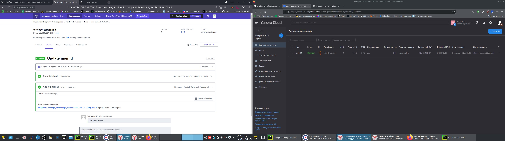

#Домашнее задание к занятию "7.4. Средства командной работы над инфраструктурой."

##Задача 1. Настроить terraform cloud

Ответ:


#Задача 2. Написать серверный конфиг для атлантиса.

Ответ:
По инструкции `https://www.runatlantis.io/guide/testing-locally.html#start-atlantis` Атлантис запустил.
<details><summary>Вот он, вроде работает:</summary>

```text
(venv) [cats@host-63 terraform]$ atlantis server \
> --atlantis-url="$URL" \
> --gh-user="$USERNAME" \
> --gh-token="$TOKEN" \
> --gh-webhook-secret="$SECRET" \
> --repo-allowlist="$REPO_ALLOWLIST"
{"level":"warn","ts":"2022-04-05T21:04:03.749+0300","caller":"policy/conftest_client.go:143","msg":"failed to get default conftest version. Will attempt request scoped lazy loads DEFAULT_CONFTEST_VERSION not set","json":{},"stacktrace":"github.com/runatlantis/atlantis/server/core/runtime/policy.NewConfTestExecutorWorkflow\n\t/home/runner/work/atlantis/atlantis/server/core/runtime/policy/conftest_client.go:143\ngithub.com/runatlantis/atlantis/server.NewServer\n\t/home/runner/work/atlantis/atlantis/server/server.go:494\ngithub.com/runatlantis/atlantis/cmd.(*DefaultServerCreator).NewServer\n\t/home/runner/work/atlantis/atlantis/cmd/server.go:490\ngithub.com/runatlantis/atlantis/cmd.(*ServerCmd).run\n\t/home/runner/work/atlantis/atlantis/cmd/server.go:613\ngithub.com/runatlantis/atlantis/cmd.(*ServerCmd).Init.func2\n\t/home/runner/work/atlantis/atlantis/cmd/server.go:505\ngithub.com/runatlantis/atlantis/cmd.(*ServerCmd).withErrPrint.func1\n\t/home/runner/work/atlantis/atlantis/cmd/server.go:895\ngithub.com/spf13/cobra.(*Command).execute\n\t/home/runner/go/pkg/mod/github.com/spf13/cobra@v0.0.0-20170905172051-b78744579491/command.go:650\ngithub.com/spf13/cobra.(*Command).ExecuteC\n\t/home/runner/go/pkg/mod/github.com/spf13/cobra@v0.0.0-20170905172051-b78744579491/command.go:729\ngithub.com/spf13/cobra.(*Command).Execute\n\t/home/runner/go/pkg/mod/github.com/spf13/cobra@v0.0.0-20170905172051-b78744579491/command.go:688\ngithub.com/runatlantis/atlantis/cmd.Execute\n\t/home/runner/work/atlantis/atlantis/cmd/root.go:30\nmain.main\n\t/home/runner/work/atlantis/atlantis/main.go:49\nruntime.main\n\t/opt/hostedtoolcache/go/1.17.7/x64/src/runtime/proc.go:255"}
{"level":"info","ts":"2022-04-05T21:04:03.756+0300","caller":"server/server.go:795","msg":"Atlantis started - listening on port 4141","json":{}}
```
</details>

После стопнул это хозяйство и поиграл с `atlantis testdrive`
Создался у меня репозиторий `atlantis-example`, а в нём `https://github.com/nargamard/atlantis-example/pull/1/files`

Ответ:
По инструкции сделал server.yaml и atlantis.yaml (в нём в комментарии есть один вопрос)
<details><summary>Вот такой получился server.yaml:</summary>

```text
repos:

- id: github.com/nargamard/netology_terraform.io #Ставим, чтобы только в моих репозиториях работало, причём только в нужном мне.

  workflow: default #поставим workflow по умолчанию, дальше понадобится

  allowed_overrides: [workflow] #Делаем, чтобы можно было менять команды. В предложенной инструкции сказано, что можно ещё разрешиить apply_requirements и delete_source_branch_on_merge.

workflows:
  default:
    plan:
      steps:
        - plan:
            extra_args: ["-lock=false"] #Вроде бы оно отключает блокировку
```
</details>

<details><summary>и вот такой получился atlantis.yaml:</summary>

```text
version: 3
projects:
- dir: "7.4 terraform" #так можно писать? или надо называть без всяких пробелов и писать тогда - dir: 7.4terraform ?
  workspace: stage #указываем нужный воркспейс
  autoplan: #автоплан...
    when_modified: ["../modules/**/*.tf", "*.tf*"] #...когда меняются любые tf в корне или в директории module, указанной относительно корня проекта
- dir: netology
  workspace: prod
  autoplan:
    when_modified: ["../modules/**/*.tf", "*.tf*"]
```
</details>
Ссылки на них приведу вместе с ответом.

#Задача 3. Знакомство с каталогом модулей.

Вот такой нашелся модуль, последней версии 3.5.0
https://registry.terraform.io/modules/terraform-aws-modules/ec2-instance/aws/latest
Там же заодно ознакомился с иностранной пропагандой.

Код модуля посмотрел. Понял только, что там описано, как создаются сети и разные инстансы. В общих чертах.
Буду ли использовать модуль? Нет. Ибо не совсем понял, для чего он нужен и на amazon сейчас ничего создать нельзя. Пропаганду почитать можно, а создать что-то - нет.

Не понял, что за блок конфигураций, который надо сделать. Поясните, пожалуйста.